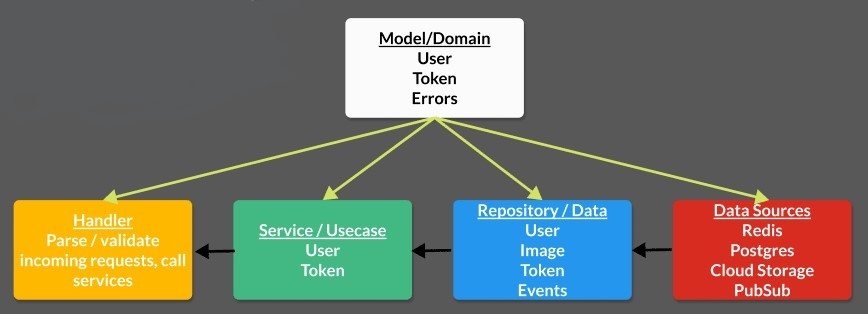

# Backend service

## Architecture Overview

The architecture for the backend service is given below. This architecture is heavily influenced by [go_clean_arch](https://github.com/bxcodec/go-clean-arch)

Incoming HTTP requests are parsed and validated by the handler layer. The handler layer calls the service layer's methods, which in turn accesses the repository, which uses data sources (persistence, data storage, etc.). Each layer depends on a "concrete implementation" of the layer to its right.

All of these layers can "work with" and pass models, defined in the model layer, to and from each other. These models hold the fundamental data properties, errors, and interfaces of the application. In some architectures, there may be a distinction between "domain models" and "data models," which will require methods for transforming the data models into domain models. I found that to be overkill for the current application, though this may be something to consider for your application.

## Architecture Benefits

This architecture lends itself well to unit testing, though this is by no means the only such architecture. Each layer can define an expectation of what each layer to its right must "implement." Any actual, or "concrete implementation," of a layer must conform to these expectations. We define these expectations in Go, and many other languages, by defining interfaces. We can then test the application layers separately by "mocking" the responses from these interfaces.